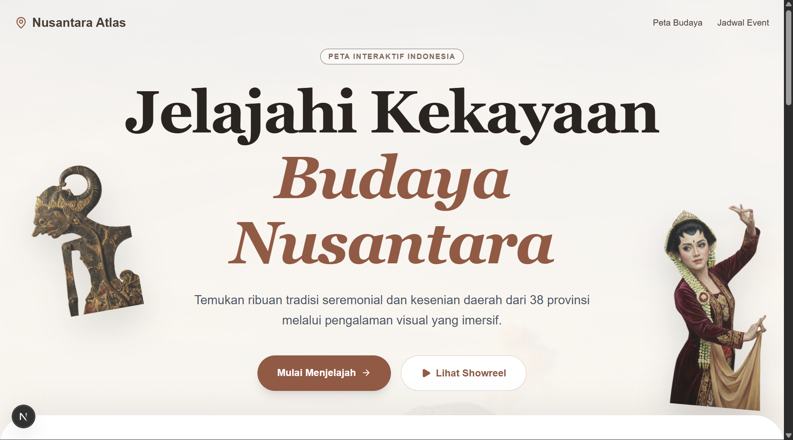

# 🌏 Nusantara Cultural Atlas

**Nusantara Cultural Atlas** adalah platform web interaktif yang didedikasikan untuk mendokumentasikan, memvisualisasikan, dan melestarikan kekayaan budaya Indonesia. Proyek ini dikembangkan untuk kompetisi **BUDAYA GO! 2025** oleh **Tim Spontan**.


_(Opsional: Kamu bisa screenshot halaman home dan simpan sebagai preview.png di folder public)_

## ✨ Fitur Utama

- **Peta Interaktif 3D:** Visualisasi peta Indonesia berbasis SVG yang responsif. Klik provinsi untuk melihat detail.
- **Profil Provinsi Imersif:** Halaman detail tiap provinsi dengan efek parallax, galeri bento grid, dan video budaya.
- **Kalender Event Budaya:** Jadwal festival dan upacara adat dengan fitur pencarian dan filter kategori.
- **Asisten Budaya AI:** (Coming Soon) Chatbot untuk tanya jawab seputar budaya.
- **Animasi Halus:** Menggunakan Framer Motion untuk pengalaman pengguna yang premium.

## 🛠️ Teknologi yang Digunakan

- **Framework:** [Next.js 14](https://nextjs.org/) (App Router)
- **Language:** [TypeScript](https://www.typescriptlang.org/)
- **Styling:** [Tailwind CSS](https://tailwindcss.com/)
- **Animation:** [Framer Motion](https://www.framer.com/motion/)
- **Icons:** [Lucide React](https://lucide.dev/)
- **Maps Visualization:** `react-simple-maps` & `d3-geo`
- **Avatar Generation:** DiceBear API

## 🚀 Cara Menjalankan di Lokal (Installation)

Ikuti langkah-langkah berikut untuk menjalankan proyek ini di komputer Anda:

### 1. Prasyarat (Prerequisites)

Pastikan Anda sudah menginstall:

- [Node.js](https://nodejs.org/) (Versi 18.17 atau lebih baru)
- Git

### 2. Clone Repository

Buka terminal atau command prompt, lalu clone repository ini:

```bash
git clone [https://github.com/USERNAME_GITHUB_KAMU/NAMA_REPO_KAMU.git](https://github.com/USERNAME_GITHUB_KAMU/NAMA_REPO_KAMU.git)
cd NAMA_REPO_KAMU
```
